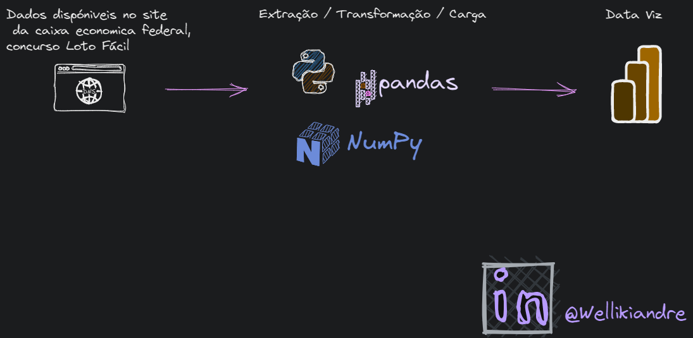
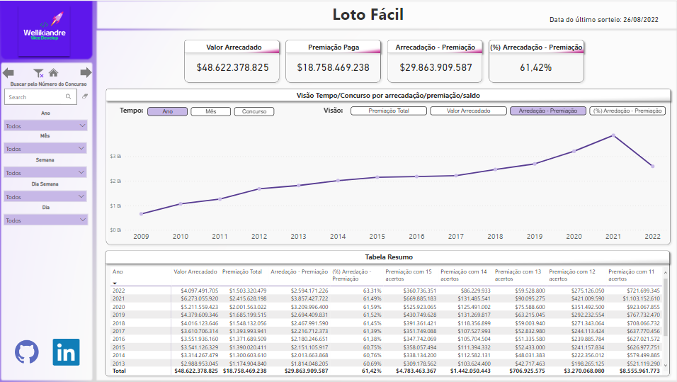

<div align="center" id="top"> 
  &#xa0;
</div>

<h1 align="center">Projeto Coleta e Análise de Dados LotoFácil</h1>
Projeto foi realizado para ensinar jovens a utilizar as ferramentas abaixo de formaa descontraida
<p align="center">
  <a href="https://www.linkedin.com/in/wellikiandre/">
    
  </a>
</p>

<p align="center">
  <a href="#dart-about">Sobre</a> &#xa0; | &#xa0; 
  <a href="#sparkles-features">Features</a> &#xa0; | &#xa0;
  <a href="#rocket-technologies">Tecnologias</a> &#xa0; | &#xa0;
  <a href="#white_check_mark-requirements">Requisitos</a> &#xa0; | &#xa0;
  <a href="#checkered_flag-starting">Iniciando</a> &#xa0; | &#xa0;
  <a href="#heavy_check_mark-projeto">Projeto</a> &#xa0; | &#xa0;
  <a href="#memo-license">Licença</a>
</p>

<br>


<p align="center">
  <a href="https://app.powerbi.com/view?r=eyJrIjoiNWU3N2YyMDQtMjk5Yy00YzQxLTgyMDktYWZmNDA4ZDc2NTA5IiwidCI6IjYyN2Y5OGM3LTQwNWQtNDdmOS05MGVlLTA4OWMzNTRlNWRmZCJ9" target="_blank">
    
  </a>
</p>


<!-- Botão Power BI -->
<p align="center">
  <a href="https://app.powerbi.com/view?r=eyJrIjoiNWU3N2YyMDQtMjk5Yy00YzQxLTgyMDktYWZmNDA4ZDc2NTA5IiwidCI6IjYyN2Y5OGM3LTQwNWQtNDdmOS05MGVlLTA4OWMzNTRlNWRmZCJ9" target="_blank">
    
  </a>
</p>


## :dart: About

Projeto criado em **07/09/2022**, realizando *web scraping* dos concursos da **LotoFácil** diretamente do site da Loteria Federal.  
Foi aplicado o conceito de camadas **Bronze → Prata → Ouro**, finalizando com a disponibilização da camada Ouro para consumo no **Data Viz**.

---

## :sparkles: Features

:heavy_check_mark: Levantamento de requisitos  
:heavy_check_mark: Engenharia de dados: coleta, tratamento e disponibilização  
:heavy_check_mark: Análise exploratória e insights

---

## :rocket: Technologies

Ferramentas utilizadas neste projeto:

- [Python](https://www.python.org/)
- [Pandas](https://pandas.pydata.org/)
- [NumPy](https://numpy.org/)
- [Power BI](https://powerbi.microsoft.com/pt-br/)

---

## :white_check_mark: Requirements

É necessário ter instalado:

- [Git](https://git-scm.com)  
- [Python](https://www.python.org/)

Depois, siga os passos da seção **Starting**.

---

## :checkered_flag: Starting

```bash
# Clone este projeto
git clone https://github.com/Wellikiandre/ColetaDeDadosLoteria.git

# Instale as dependências
pip install -r requirements.txt
