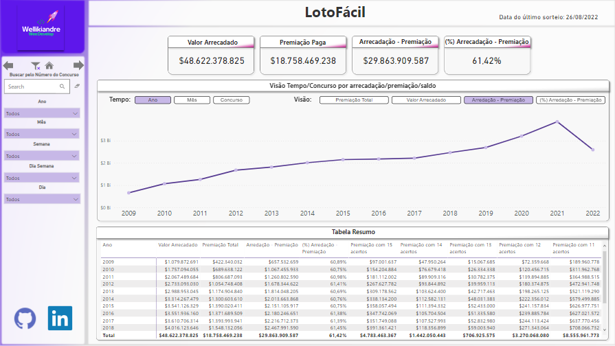

<div align="center" id="top"> 
  <a href="https://www.linkedin.com/in/wellikiandre/">
     
</a>

  &#xa0;

  <!-- <a href="https://www.linkedin.com/in/wellikiandre/">LinkdeIn</a> -->
</div>

<h1 align="center">Projeto Coleta de Dados Loto Fácil</h1>

<p align="center">

<a href="https://www.linkedin.com/in/wellikiandre/">
     
</a>
  <!-- -->

  <!-- -->

 <!-- -->

  <!---->

  <!--  -->

  <!--  -->

  <!--  -->
</p>

<!-- Status -->

<!-- <h4 align="center"> 
	🚧  Padronização De Readme De Projeto 🚀 Under construction...  🚧
</h4> 


<hr> -->

<p align="center">
  <a href="#dart-about">About</a> &#xa0; | &#xa0; 
  <a href="#sparkles-features">Features</a> &#xa0; | &#xa0;
  <a href="#rocket-technologies">Technologies</a> &#xa0; | &#xa0;
  <a href="#white_check_mark-requirements">Requirements</a> &#xa0; | &#xa0;
  <a href="#checkered_flag-starting">Starting</a> &#xa0; | &#xa0;
  <a href="#memo-license">License</a> &#xa0; | &#xa0;
  <a href="#heavy_check_mark-projeto">Data Viz</a>&#xa0; | &#xa0;
</p>

<br>

## :dart: About ##

Este projeto foi elaborado em 07/09/2022, onde foi realizado o web scraping do site da loteria federal do concurso Loto Fácil, durante o projeto foi utilizado o tratamento dos dados da coleta em camadas Bronze, Prata e Ouro. Por fim a camada Ouro foi disponibilizada e consumida pelo Data Viz.

## :sparkles: Features ##

:heavy_check_mark: Levantamento de Requisitos;\
:heavy_check_mark: Engenharia de dados : Coletar, Tratar e disponibilizar o dado;\
:heavy_check_mark: Analise de dados: Consumir, analisar e disponilizar os insight;

## :rocket: Technologies ##

The following tools were used in this project:
Neste projeto foram utilizadas as seguintes ferramentas:

- [Python](https://www.python.org/)
- [Pandas](https://pandas.pydata.org/)
- [Numpy](https://numpy.org/)
- [PowerBI](https://powerbi.microsoft.com/pt-br/)

## :white_check_mark: Requirements ##

Tenha certeza de tenha instalado [Git](https://git-scm.com) e [Python](https://www.python.org/) , seguir a etapa Starting.

## :checkered_flag: Starting ##

```bash
# Clone this project
$ git clone https://github.com/Wellikiandre/ColetaDeDadosLoteria.git


# Install dependencies
$ pip install -r requirements.txt

```

## :memo: License ##

Made with :heart: by <a href="https://www.linkedin.com/in/wellikiandre/" target="_blank">{{Wee Wellikiandre}}</a>

&#xa0;

## :heavy_check_mark: Projeto ##

### ETL - Coleta de Dados ###


<a href="https://www.linkedin.com/in/wellikiandre/">
     
</a>

### Data Viz - PowerBI ###

Resumo: Analisando todos os concursos desde de 2009 tiramos algums insight bem rápidos.
1- Desde 2009 a diferença entre arrecadação e premiação varia de 60,7% a 63,3% ao ano.
2- A curva entre arrecadação e premiação possuem a mesma correlação , ou seja, a variavel arrecadação influencia diretamente.
3- A premiação paga com 11 acertos tem um valor bruto pago maior que todas as outras faixa de acertos, sendo elas com 12 , 13 , 14 ou 15 acertos. 

#####Clicando na imagem você será enviado para o Data Viz

<a href="https://app.powerbi.com/view?r=eyJrIjoiNWU3N2YyMDQtMjk5Yy00YzQxLTgyMDktYWZmNDA4ZDc2NTA5IiwidCI6IjYyN2Y5OGM3LTQwNWQtNDdmOS05MGVlLTA4OWMzNTRlNWRmZCJ9">
     
</a>

<a href="#top">Back to top</a>
